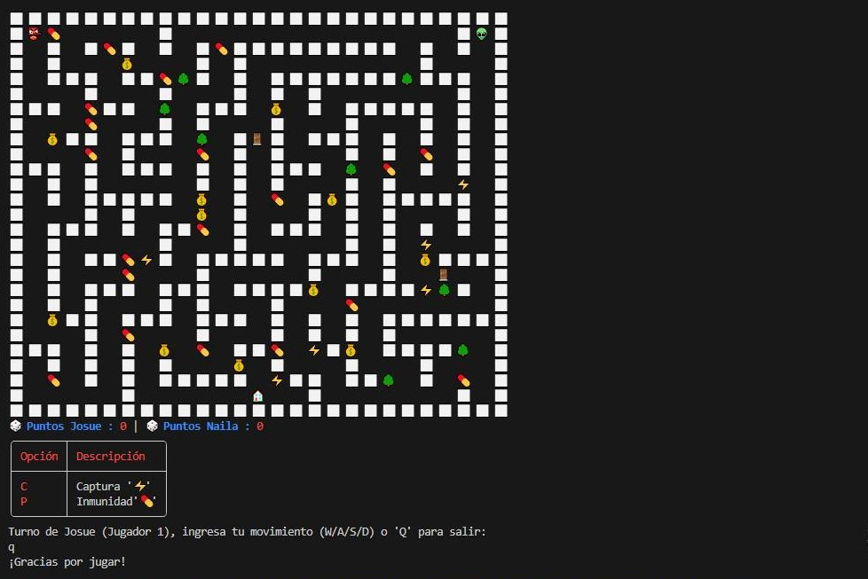

# Juego de Laberinto en C#

¡Bienvenido al proyecto del Juego de Laberinto! Este es un juego de consola desarrollado en C# donde los jugadores deben navegar a través de un laberinto para encontrar la salida. Es un proyecto divertido y educativo que demuestra conceptos de programación como estructuras de datos, algoritmos y lógica de juego.

## Características

- **Navegación en el Laberinto**: Mueve al jugador a través de un laberinto generado aleatoriamente.
- **Interfaz de Consola**: Una interfaz simple y fácil de usar que permite a los jugadores interactuar con el juego.
- **Niveles de Dificultad**: Diferentes niveles de dificultad que afectan el tamaño y la complejidad del laberinto.
- **Sistema de Puntuación**: Registra el tiempo que tarda el jugador en encontrar la salida.

## Requisitos

- .NET Core 3.1 o superior
- Un entorno de desarrollo compatible (Visual Studio, Visual Studio Code, etc.)

## Instalación

1. Clona el repositorio:
   ```bash
   git clone https://github.com/tu_usuario/juego-laberinto.git

2. **Navega al directorio del proyecto**:
   ```bash
   cd juego-laberinto

3. **Restaurar las dependencias**:
   ```bash
   dotnet restore

4. **Ejecuta el juego**:
   ```bash
   dotnet run

## Instrucciones del juego

El juego de laberinto es un juego de consola en el que debes navegar a través de un laberinto para encontrar la salida. El juego cuenta con una inteligencia artificial (IA) que controla al segundo jugador.

### Objetivo del juego

El objetivo del juego es encontrar la salida del laberinto antes que el segundo jugador.

### Controles del juego

* **Mover al jugador**: Utiliza las teclas de flecha para mover al jugador a través del laberinto.(W/A/S/D).
* **Utilizar poderes**: Utiliza las teclas de función (C, F, P) para utilizar los poderes del jugador.

### Poderes del jugador

* **Ficha de velocidad**: Aumenta la velocidad del jugador durante 5 segundos.
* **Ficha de invisibilidad**: Hace que el jugador sea invisible durante 3 segundos.
* **Ficha de fuerza**: Aumenta la fuerza del jugador durante 2 segundos.

### Inteligencia artificial (IA)

La IA controla al segundo jugador y utiliza un algoritmo de búsqueda para encontrar la salida del laberinto. La IA también puede utilizar los poderes del jugador para intentar bloquear al primer jugador.

### Condición de victoria

El juego termina cuando el primer jugador encuentra la salida del laberinto o cuando la IA encuentra la salida del laberinto represenada como 🏠 antes que el primer jugador.

## ¿Cómo jugar?

Para evaluar el funcionamiento del juego, necesitas entender cómo interactuar con él. A continuación, te proporcionamos las funcionalidades disponibles y las instrucciones detalladas sobre cómo realizar cada acción:

### Controles

* Usa las teclas para mover al jugador a través del laberinto.
* El objetivo es encontrar la salida del laberinto.

### Teclas de poderes

* **Ficha de destrucción de obstáculos 💰**: tecla 'F'
* **Ficha de invisibilidad Inmunidad a Poderes Captura 💊**: tecla 'P'
* **Ficha de captura ⚡**: tecla 'C'
* **Ficha de Teletransportación ⏱🚪**: Cuando un jugador alcance una puerta de teletransportación, será teletransportado a una nueva dimensión del mapa.

### Jugadores

* **Jugador 1**: controlado por el usuario.
* **Jugador 2**: controlado por la computadora.

## Modos de juego

El juego de laberinto ofrece dos modos de juego:

### Modo de juego 1: Jugador vs. Computadora

En este modo de juego, puedes jugar contra la computadora. ¡Pero ten cuidado! La IA es tramposa y hará todo lo posible para ganar. ¡Buena suerte!

### Modo de juego 2: Jugador vs. Jugador

En este modo de juego, puedes jugar con un amigo o familiar. ¡Compite para ver quién puede encontrar la salida del laberinto primero!

## Desarrollo del juego

Al principio, estás desarmado y sin poderes. Pero a medida que te vas desarrollando en el juego, puedes recoger fichas que te permiten mejorar tus habilidades y aumentar tus chances de ganar. ¡Así que no te rindas! Sigue adelante y verás que puedes convertirte en un verdadero guerrero.

## Personajes

A continuación, te presentamos los personajes del juego:

### Slyrak 👾

Slyrak es un alienígena de un planeta lejano que ha sido enviado a la Tierra para explorar y descubrir nuevos mundos. Con su tecnología avanzada y su capacidad para adaptarse a cualquier entorno, Slyrak es un personaje formidable en el juego. Su objetivo es encontrar la salida del laberinto y regresar a su planeta natal.

### Luna 👧

Luna es una joven aventurera que ha sido atrapada en el laberinto mientras buscaba un tesoro legendario. Con su agilidad y su capacidad para resolver problemas, Luna es un personaje rápido y astuto en el juego. Su objetivo es encontrar la salida del laberinto y escapar de la trampa que la ha atrapado.

### Rush 👺

Rush es un guerrero feroz que ha sido enviado al laberinto para probar su valentía y su habilidad en combate. Con su fuerza y su velocidad, Rush es un personaje formidable en el juego. Su objetivo es encontrar la salida del laberinto y demostrar su superioridad sobre los demás personajes.

### Mirana 👸

Mirana es una princesa de un reino lejano que ha sido secuestrada por un malvado hechicero y llevada al laberinto. Con su inteligencia y su capacidad para resolver problemas, Mirana es un personaje astuto y estratégico en el juego. Su objetivo es encontrar la salida del laberinto y escapar de la trampa que la ha atrapado.

### Abaddon 👽

Abaddon es un demonio del infierno que ha sido enviado al laberinto para causar caos y destrucción. Con su poder y su capacidad para manipular el fuego, Abaddon es un personaje formidable y temido en el juego. Su objetivo es encontrar la salida del laberinto y regresar al infierno para seguir causando destrucción.


## Detalles de la implementación

A continuación, te proporcionamos información relevante sobre cómo se desarrolló el proyecto:

### Tecnologías utilizadas

* C# como lenguaje de programación.
* .NET Core 3.1 como framework.
* Visual Studio Code como entorno de desarrollo.

### Estructura del código

* El código se divide en diferentes clases y métodos para una mejor organización y reutilización.
* Se utilizan patrones de diseño para mejorar la legibilidad y mantenibilidad del código.

### Desafíos enfrentados

* Generar un laberinto aleatorio cada vez que se inicia el juego.
* Implementar un sistema de puntuación para registrar el tiempo de juego.

## Capturas de pantalla

Aquí te dejo algunas capturas de pantalla del juego:



## Contribuciones

Las contribuciones son bienvenidas. Si deseas mejorar el juego o agregar nuevas características, no dudes en abrir un problema o enviar un pull request.

## Licencia

Este proyecto está bajo la licencia [MIT](https://github.com/tu_usuario/juego-laberinto/blob/main/LICENSE).

## Autores

* [Tu nombre](https://github.com/tu_usuario)

## Agradecimientos

* A todos los que han contribuido al proyecto.

[](https://github.com/tu_usuario/juego-laberinto)


